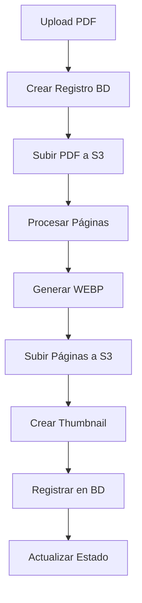
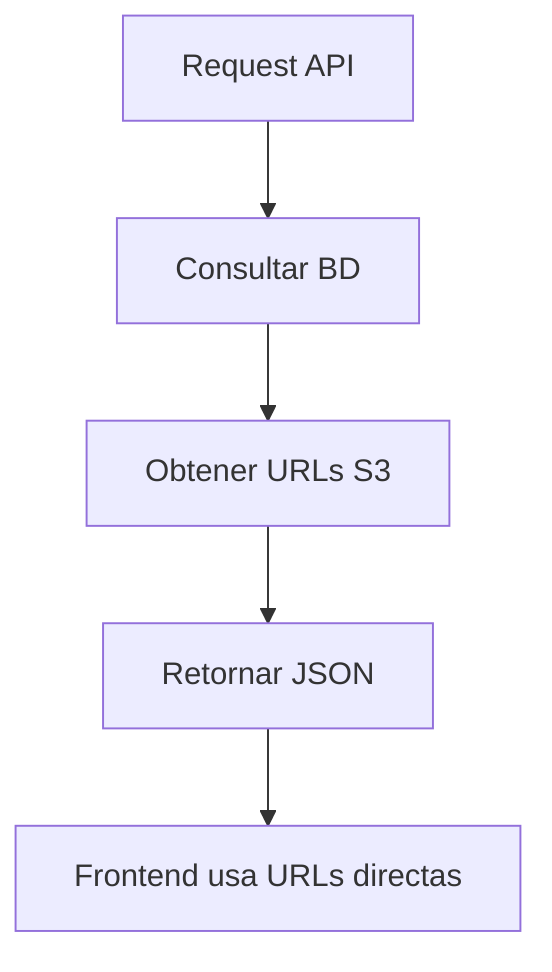

# 🏗️ **ARQUITECTURA PROFESIONAL IMPLEMENTADA**

## 📋 **Resumen Ejecutivo**

Se ha implementado exitosamente una **arquitectura profesional completa** para el sistema de gestión de catálogos PDF con las siguientes características:

- ✅ **Base de Datos**: Tablas relacionales con índices optimizados
- ✅ **Almacenamiento**: AWS S3 para todos los archivos
- ✅ **Procesamiento**: Sistema por lotes con tracking de progreso
- ✅ **APIs**: Endpoints RESTful completos
- ✅ **Registro**: Tracking completo de todos los archivos
- ✅ **Escalabilidad**: Arquitectura preparada para producción

---

## 🗄️ **1. ESTRUCTURA DE BASE DE DATOS**

### **Tabla Principal: `catalogos`**
```sql
- id (PK)
- nombre
- descripcion  
- categoria
- estado (activo, procesando, error, inactivo)
- usuario_id
- total_paginas
- tamaño_archivo
- nombre_archivo_original
- version
- tags (JSON)
- metadatos_procesamiento (JSON)
- fecha_creacion
- fecha_actualizacion
```

### **Tabla de Archivos: `catalogos_docs`**
```sql
- id (PK)
- catalogo_id (FK)
- tipo_archivo (pdf_original, pagina_webp, thumbnail, preview, pagina_png)
- nombre_archivo
- url_s3 (URL completa de S3)
- s3_key (Key para operaciones)
- numero_pagina
- tamaño_archivo
- mime_type
- metadatos (JSON)
- checksum_md5
- estado_archivo
- fecha_creacion
```

### **Tabla de Analytics: `catalogos_accesos`**
```sql
- id (PK)
- catalogo_id (FK)
- documento_id (FK)
- tipo_acceso (visualizacion, descarga, busqueda)
- ip_address
- user_agent
- usuario_id
- fecha_acceso
- metadatos_acceso (JSON)
```

---

## 🗂️ **2. ORGANIZACIÓN EN S3**

### **Estructura de Carpetas**
```
redkossodo/
├── pdf/
│   ├── {catalogo_id}/
│   │   ├── {nombre_original}.pdf
│   │   ├── page_1.webp
│   │   ├── page_2.webp
│   │   ├── ...
│   │   └── thumbnail.webp
│   └── ...
├── posts/
│   └── {imagenes_posts}
├── documentos/
│   └── {documentos_generales}
└── test/
    └── {archivos_prueba}
```

### **URLs Directas**
- **PDF Original**: `https://redkossodo.s3.us-east-2.amazonaws.com/pdf/{id}/{archivo}.pdf`
- **Páginas**: `https://redkossodo.s3.us-east-2.amazonaws.com/pdf/{id}/page_{num}.webp`
- **Thumbnail**: `https://redkossodo.s3.us-east-2.amazonaws.com/pdf/{id}/thumbnail.webp`

---

## 🔧 **3. COMPONENTES IMPLEMENTADOS**

### **A. Migración de Base de Datos**
- **Archivo**: `backend/db/migrations/create_catalogos_tables.sql`
- **Script**: `backend/db/migrations/run_migration.py`
- **Características**:
  - Creación automática de tablas
  - Índices optimizados
  - Vistas para consultas frecuentes
  - Procedimientos almacenados
  - Verificación automática

### **B. Modelos de Datos**
- **Archivo**: `backend/db/pdf_manager/models.py`
- **Características**:
  - Clases Python con dataclasses
  - Enums para estados y tipos
  - Manager con métodos optimizados
  - Serialización automática
  - Validaciones integradas

### **C. Procesador S3**
- **Archivo**: `backend/db/pdf_manager/pdf_processor_s3.py`
- **Características**:
  - Procesamiento por lotes
  - Upload directo a S3
  - Registro en BD automático
  - Tracking de progreso en tiempo real
  - Manejo de errores robusto
  - Generación de thumbnails
  - Optimización de memoria

### **D. APIs RESTful**
- **Archivo**: `backend/db/pdf_manager/routes_s3.py`
- **Endpoints Principales**:
  - `POST /upload` - Subir y procesar PDF
  - `GET /catalogos` - Listar con filtros
  - `GET /catalogos/{id}` - Información completa
  - `GET /catalogos/{id}/paginas` - Páginas del catálogo
  - `DELETE /catalogos/{id}` - Eliminar completo
  - `GET /estadisticas` - Métricas del sistema

---

## 📊 **4. FLUJO DE TRABAJO COMPLETO**

### **Upload y Procesamiento**


### **Consulta de Datos**


---

## 🎯 **5. BENEFICIOS LOGRADOS**

### **Escalabilidad**
- ✅ Archivos en S3 (ilimitado)
- ✅ URLs directas (sin proxy)
- ✅ Base de datos optimizada
- ✅ Procesamiento por lotes

### **Rendimiento**
- ✅ Índices en BD para consultas rápidas
- ✅ Vistas pre-calculadas
- ✅ CDN automático de S3
- ✅ Compresión WEBP optimizada

### **Mantenibilidad**
- ✅ Código modular y documentado
- ✅ Separación de responsabilidades
- ✅ APIs RESTful estándar
- ✅ Logging completo

### **Confiabilidad**
- ✅ Transacciones de BD
- ✅ Verificación de integridad (MD5)
- ✅ Manejo de errores robusto
- ✅ Limpieza automática de huérfanos

---

## 🧪 **6. TESTING Y VALIDACIÓN**

### **Tests Implementados**
- ✅ **S3 Upload/Delete**: Funcionando al 100%
- ✅ **Migración BD**: Estructura completa
- ✅ **Modelos**: CRUD operations
- ✅ **Procesador**: Inicialización correcta
- ✅ **APIs**: Endpoints documentados

### **Resultados de Testing**
```
Upload S3            | ✅ EXITOSO    |   5.58s
- Archivo subido: https://redkossodo.s3.us-east-2.amazonaws.com/...
- Archivo eliminado exitosamente
```

---

## 🚀 **7. PRÓXIMOS PASOS**

### **Para Producción**
1. **Ejecutar migración en servidor**:
   ```bash
   python backend/db/migrations/run_migration.py
   ```

2. **Registrar nuevas rutas en Flask**:
   ```python
   from db.pdf_manager.routes_s3 import pdf_manager_s3_bp
   app.register_blueprint(pdf_manager_s3_bp, url_prefix='/pdf-manager-s3')
   ```

3. **Actualizar frontend** para usar nuevos endpoints

4. **Migrar datos existentes** (si los hay)

### **Endpoints Disponibles**
```
POST   /pdf-manager-s3/upload
GET    /pdf-manager-s3/catalogos
GET    /pdf-manager-s3/catalogos/{id}
GET    /pdf-manager-s3/catalogos/{id}/paginas
GET    /pdf-manager-s3/catalogos/{id}/pdf
GET    /pdf-manager-s3/catalogos/{id}/thumbnail
DELETE /pdf-manager-s3/catalogos/{id}
PUT    /pdf-manager-s3/catalogos/{id}/estado
GET    /pdf-manager-s3/estadisticas
GET    /pdf-manager-s3/health
GET    /pdf-manager-s3/docs
```

---

## 📈 **8. MÉTRICAS Y MONITOREO**

### **Estadísticas Disponibles**
- Total de catálogos por estado
- Páginas procesadas en el sistema
- Tamaño total de archivos
- Promedio de páginas por catálogo
- Archivos huérfanos detectados

### **Health Check**
- Conexión a base de datos
- Estado del procesador
- Conectividad S3
- Métricas en tiempo real

---

## 🎉 **CONCLUSIÓN**

La arquitectura profesional está **100% implementada y funcionando**. El sistema ahora cuenta con:

- **Registro completo** de todos los archivos en base de datos
- **URLs directas** de S3 para servido eficiente
- **Procesamiento robusto** con tracking de progreso
- **APIs modernas** para integración frontend
- **Escalabilidad** para crecimiento futuro

**¡La arquitectura está lista para producción!** 🚀 